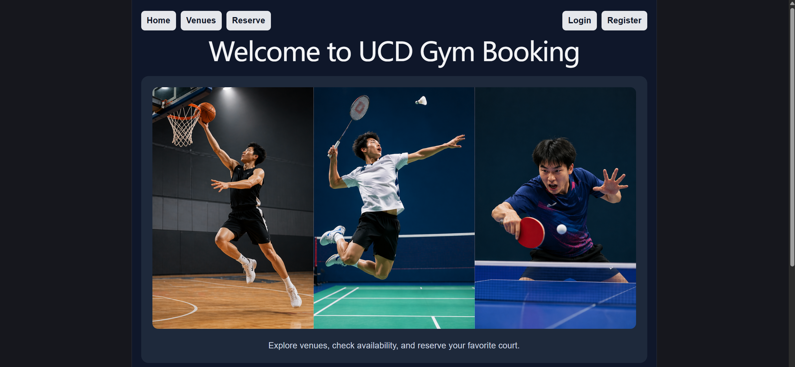
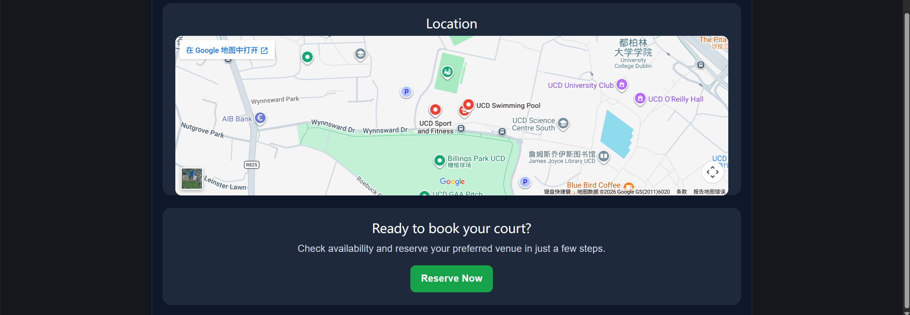
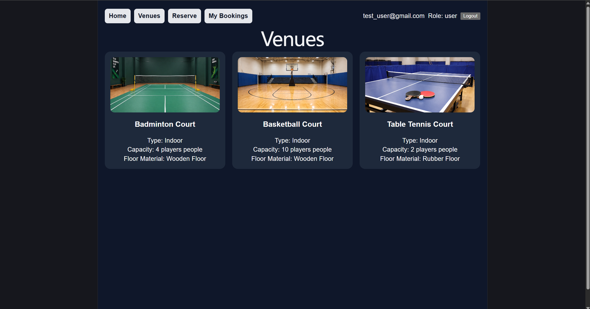
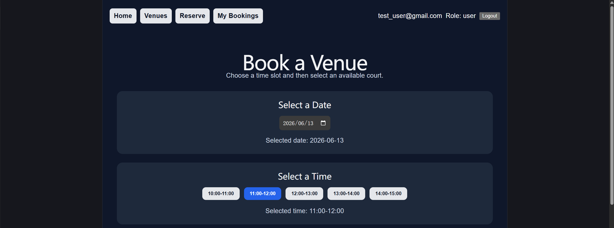
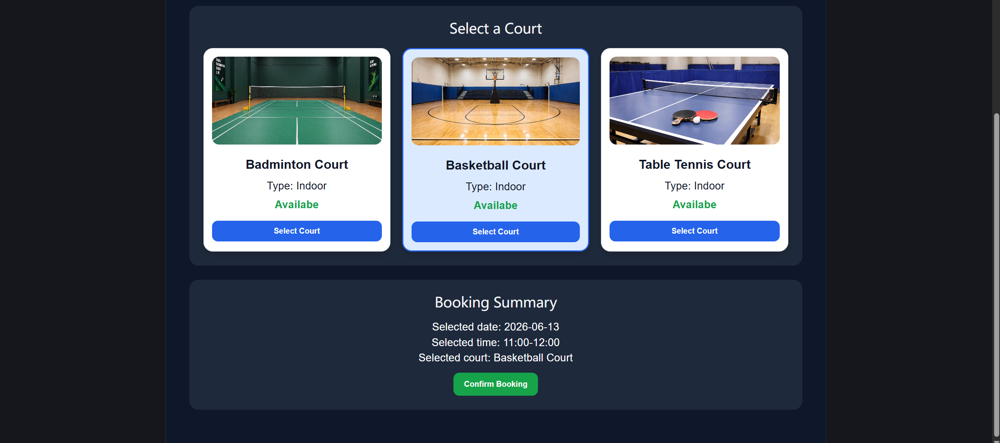
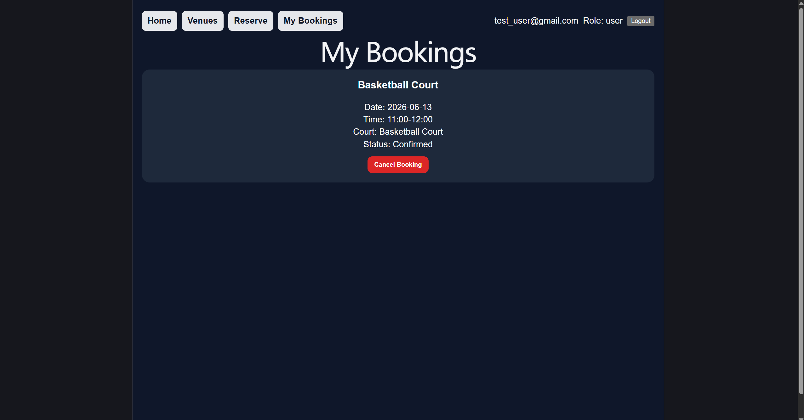
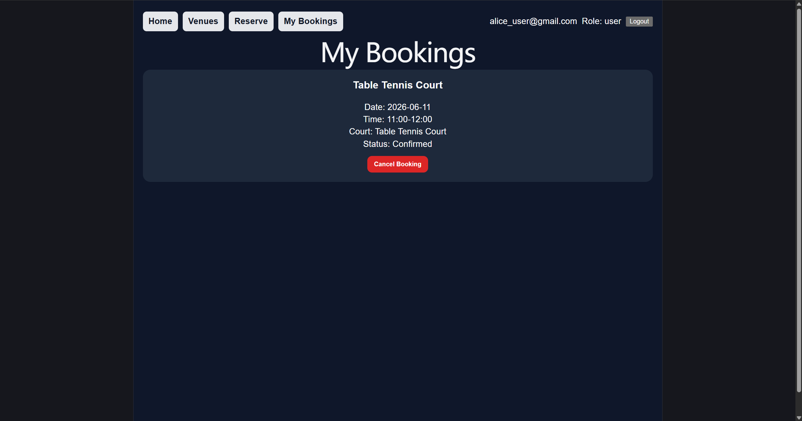
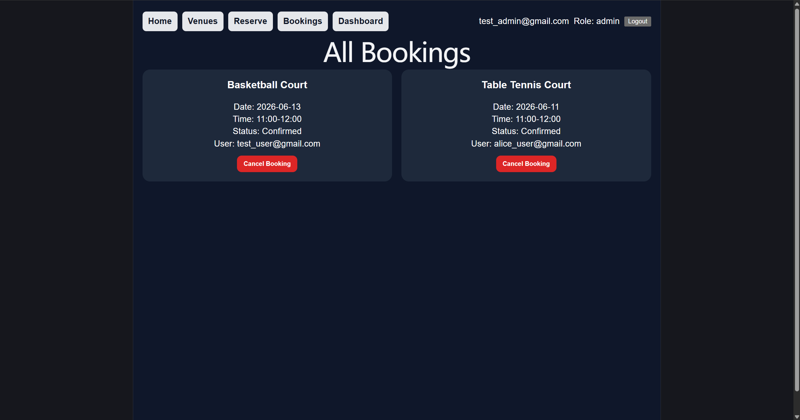
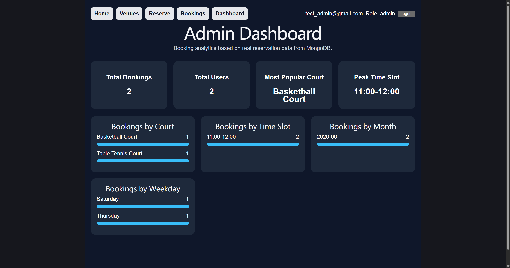

# Court Booking System

A full-stack sports court booking system built with React, Node.js, Express, and MongoDB Atlas.

The application supports user registration and login, sports venue browsing, court reservation management, admin booking oversight, analytics dashboard, JWT authentication, and booking conflict validation.

This project was developed to practice full-stack application architecture, REST API design, authentication and authorization, database persistence, and backend integration testing.

## Features

- User registration and login
- JWT-based authentication
- bcrypt password hashing
- Sports venue browsing
- Court reservation system
- Booking conflict prevention
- User-specific booking history
- Admin dashboard and analytics
- Role-based access control
- MongoDB Atlas integration
- Backend API testing with Jest and Supertest

## Tech Stack

### Frontend
- React
- React Router
- Vite

### Backend
- Node.js
- Express.js

### Database
- MongoDB Atlas

### Authentication & Security
- JWT
- bcrypt
- dotenv

### Testing
- Jest
- Supertest

## Project Structure

```text
court-booking-system/
├── frontend/
│   ├── src/
│   ├── public/
│   └── package.json
│
├── backend/
│   ├── tests/
│   ├── server.js
│   └── package.json
│
└── README.md
```

## Screenshots

### Home Page



### Venues Page


### Reservation Page



### Bookings Page




### Admin Dashboard


## Installation

### Frontend

```bash
cd frontend
npm install
npm run dev
```
### Backend

```bash
cd backend
npm install
node server.js
```
## Environment Variables

Create a .env file inside backend/
```env
MONGODB_URI=your_mongodb_connection_string
JWT_SECRET=your_secret_key
```
## API Endpoints

| Method | Endpoint | Description |
|---|---|---|
| POST | /api/register | Register a new user |
| POST | /api/login | User login |
| GET | /api/venues | Fetch all venues |
| GET | /api/bookings | Fetch all bookings |
| POST | /api/bookings | Create a booking |
| DELETE | /api/bookings/:id | Cancel a booking |

## Testing

Backend integration tests were implemented using Jest and Supertest.

Run tests:
```bash
npm test
```
## Future Improvements

- Venue maintenance scheduling
- Booking notifications
- Frontend component testing
- Deployment with Vercel and Render
- JWT protection for all booking APIs


